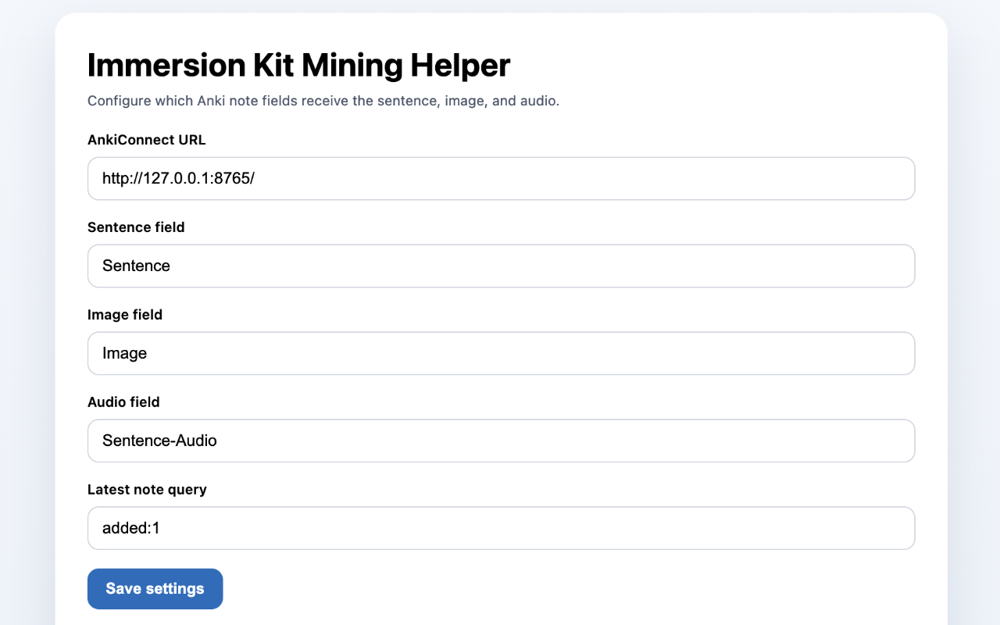

#  ImmersionKit Mining Helper

ImmersionKit Mining Helper adds an `Add to latest Anki card` action to ImmersionKit example rows. It sends the selected sentence, image, and audio to your latest matching Anki note through AnkiConnect.

## Screenshots




## Using the Extension

### Prerequisites

You will need the following installed:

- [Anki](https://apps.ankiweb.net/)
- [AnkiConnect](https://ankiweb.net/shared/info/2055492159)
  - add `https://www.immersionkit.com` to `webCorsOriginList` in the AnkiConnect add-on settings

### Instructions

- Either install the extension from the Chrome Web Store once it is published, or build and load manually (see below).
- Set up your vocabulary deck. It should have at least the following fields:
  - Sentence
  - Sentence-Audio
  - Image
- Open the extension settings and set up your field names
- Open a word in ImmersionKit, for example `https://www.immersionkit.com/dictionary?keyword=天気`.
- Add the word to Anki.
- Click `Add to latest Anki card` next to an example. The extension updates the latest matching Anki note using the configured fields.

## Developers

### Local setup

- [pnpm](https://pnpm.io/)
- Google Chrome or another Chromium-based browser

1. Install dependencies:

   ```bash
   pnpm install
   ```

2. Build the extension:

   ```bash
   pnpm build
   ```

3. Open `chrome://extensions`.
4. Enable **Developer mode**.
5. Click **Load unpacked** and select the [`dist`](dist) folder.
